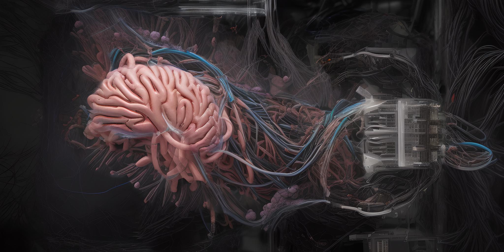

<h1 align="center">EEG Prediction using Chaos Theory, Dynamical Systems Theory, a Kuramoto Oscillator, a Conditional Recurrent Neural Net(RNN), a Convolutional Neural Net(CNN), and Transformer Neural Nets</h1>

  

  

  

  </a>

 
 
<h1 align="center">Purpose</h1>

We want to take the necessary steps towards connecting the human brain to a silicon computer or hybrid bio-silicon computer, via a biomatter brain-computer-interface. Part of this process includes the input of information directly into the human brain. Immediate readings of EEG data during the inputting of information into the human brain will need to be compared to a baseline of the real experience. An example of this is the [initial state EEG data of a human], the [EEG data state during, and immediately after, viewing a sequence of events in VR], and the [initial state EEG data of that same human], the [EEG data state during, and immediately after, having the visual data input into their brain].
 
 
<h1 align="center">Explanation</h1>

The central aim of this research project is to predict the electroencephalographic (EEG) effects of transcranial electrical stimulation (tES) by integrating chaos theory, dynamical systems theory, and a neural net stack. This is due to the importance of nonlinear dynamics in understanding brain activity.

This research has significant potential implications for the field of brain-computer interfaces, particularly for the novel area of connecting a human brain to a biohybrid silicon/biological computer[1] through a biological neural interface[2].

Accurately predicting the brain's reactions to tES could enable us to fine-tune the stimulation parameters, optimizing the quality of communication between the human brain and the hybrid computer. This could pave the way for developing protocols that ensure efficient and reliable transmission of information along the biomatter cable, essentially turning thoughts and brain activity into actionable commands for the hybrid computer.

This research could potentially contribute to the ambitious goal of directly stimulating sensorial perceptions in the human brain[3][4], a feat which, if achieved, would revolutionize neuroprosthetics and human-computer interfaces. The brain's sensorial system is intricate, involving a complex network of interconnected regions responsible for processing and interpreting different aspects of sensory information. The endeavor to predict EEG effects of tES using a multidisciplinary approach could shed light on how this complex system responds to external stimulation, and could possibly inform targeted, controlled stimulation techniques. While the research is not directly aimed at inducing visual perceptions, the insights and methodologies derived from the work could serve as a stepping stone towards understanding how to interface with the brain's sensory nervous system more effectively. It's crucial to note that this potential application would need to address substantial scientific, technical, and ethical challenges. Despite these hurdles, the promise of such a breakthrough underscores the broad-reaching implications of our research and its potential to catalyze advances in several areas of neuroscience and neurotechnology.

This research could contribute significantly to the field of decoding and encoding sensory perceptions in the human brain. The proposed model, which integrates chaos theory, dynamical systems theory, and a neural network stack, could provide a robust and comprehensive tool for understanding how the brain responds to tES. Such an understanding is critical for decoding brain activity associated with sensual perception. Specifically, the proposed use of transfer entropy to measure causal relationships within the brain could provide unique insights into how different sensory regions interact and coordinate to produce perceptions. Once these perceptions are decoded[5], it becomes theoretically possible to encode similar patterns back into the brain. The development of a predictive model capable of accurately capturing these dynamics would be a pivotal step towards this goal. Thus, while the immediate focus of the research is predicting EEG effects of tES, the methodologies and insights derived from the work have broader implications and could be foundational for future efforts aimed at decoding and encoding sensual perceptions in the brain.
 
 
<h1 align="center">How to use the code</h1>
 
 
Choose the dsamp eeg data file and go through this process first so you have your necessary data ready to go (https://github.com/Metaverse-Crowdsource/EEG-tES-Chaos-Neural-Net/blob/main/Data%20Loading%20and%20Variable%20Assigning.ipynb).
 
 
Work in progress...
 
 
<h1 align="center">Dependencies</h1>
numpy: 1.24.3
 
matplotlib: 3.7.0
 
scipy: 1.10.1
 
torch: 2.0.1+cu117
 
torchdiffeq: 0.2.3
 
torchsummary: Unknown version
 
minepy: b'1.2.6'
 
pyrqa: Unknown version
 
pyts: 0.12.0
 
MFDFA: 0.4.3
 
pyinform: Unknown version
 
graphviz: 0.20.1
 
fa2: Unknown version
 
networkx: 3.0
 
 
<h1 align="center">References</h1>

[1] L. Smirnova et al., "Organoid Intelligence (OI): The New Frontier in Biocomputing and Intelligence-in-a-Dish," Frontiers in Science, vol. 7, pp. 0, 2023.

[2] A. E. Rochford et al., "Functional Neurological Restoration of Amputated Peripheral Nerve Using Biohybrid Regenerative Bioelectronics," Science Advances, vol. 9, no. 12, pp. eadd8162, 2023.

[3] E. H. Holbrook et al., "Induction of Smell through Transethmoid Electrical Stimulation of the Olfactory Bulb," International Forum of Allergy & Rhinology, vol. 7, no. 2, pp. 98-105, 2019.

[4] X. Chen et al., "Restoring Vision via Electrical Stimulation through a 1024-Channel Microelectrode Array Implanted in Visual Cortex," Brain Stimulation: Basic, Translational, and Clinical Research in Neuromodulation, vol. 16, no. 1, pp. 181-182, 2023.

[5] Y. Takagi and S. Nishimoto, "High-Resolution Image Reconstruction with Latent Diffusion Models from Human Brain Activity," in Proceedings of the IEEE/CVF Conference on Computer Vision and Pattern Recognition, 2023.

 
 
<h1 align="center">Data Source and Article</h1>

Data include within participant application of nine High-Definition tES (HD-tES) types, targeting three cortical regions (frontal, motor, parietal) with three stimulation waveforms (DC, 5 Hz, 30 Hz); more than 783 total stimulation trials over 62 sessions with EEG, physiological (ECG, EOG), and continuous behavioral vigilance/alertness metrics. Experiment 1 and 2 consisted of participants performing a continuous vigilance/alertness task over three 70-minute and two 70.5-minute sessions, respectively. Demographic data were collected, as well as self-reported wellness questionnaires before and after each session. Participants received all 9 stimulation types in Experiment 1, with each session including three stimulation types, with 4 trials per type. Participants received 2 stimulation types in Experiment 2, with 20 trials of a given stimulation type per session. Within-participant reliability was tested by repeating select sessions. This unique dataset supports a range of hypothesis testing including interactions of tDCS/tACS location and frequency, brain-state, physiology, fatigue, and cognitive performance.

Participants maintained a ball at the center of the screen and were periodically stimulated (with low-intensity noninvasive brain stimulation) for 30 secs with combinations of 9 stimulation montages.

**Dataset Article:** [https://doi.org/10.1038/s41597-021-01046-y](https://doi.org/10.1038/s41597-021-01046-y)

**Dataset:** [https://zenodo.org/record/3840615#.ZK2hJdLMKRQ](https://zenodo.org/record/3840615#.ZK2hJdLMKRQ)

**Table of stimulation condition and stimulation intensity:** [https://www.nature.com/articles/s41597-021-01046-y/tables/2](https://www.nature.com/articles/s41597-021-01046-y/tables/2)
 
 
N. Gebodh, Z. Esmaeilpour, A. Datta, and M. Bikson, "Dataset of Concurrent EEG, ECG, and Behavior with Multiple Doses of Transcranial Electrical Stimulation," Scientific Data, vol. 8, no. 1, p. 274, 2021.
 
 
<h1 align="center">Variables</h1>
 
 

| Variable       | Description                                                         |
|----------------|---------------------------------------------------------------------|
| triggers       | These are all the labeled EEG/Stimulation start/stop triggers       |
| EEGdata        | Contains the downsampled EEG/ECG/EOG voltage data dims: 35 channels X ~4E6 samples |
| fs             | The downsampled sampling frequency of the data: 1000 Hz             |
| fsOld          | The original sampling frequency of the data                         |
| time           | Time vector for the data. Should be 1 X ~4E6                        |
| label          | Contains the channel label information. BIP1= ECG, BIP2=EOG, RESP1= N/A |
| nchan          | The number of channels in the data                                  |
| rate           | Redundant to fs, sampling rate of data                              |
| npt            | Number of data points ~4E6                                          |
| Subj           | Subject and session that data

 
 

 EEG-Chaos-Kuramoto-Neural-Net by <a xmlns:cc="http://creativecommons.org/ns#" href="https://github.com/Metaverse-Crowdsource/EEG-Chaos-Kuramoto-Neural-Net" property="cc:attributionName" rel="cc:attributionURL">Metaverse Crowdsource</a> is licensed under a <a rel="license" href="http://creativecommons.org/licenses/by-sa/4.0/">Creative Commons Attribution-ShareAlike 4.0 International License</a>. Based on a work at <a xmlns:dct="http://purl.org/dc/terms/" href="https://github.com/Metaverse-Crowdsource/EEG-Chaos-Kuramoto-Neural-Net" rel="dct:source">https://github.com/Metaverse-Crowdsource/EEG-Chaos-Kuramoto-Neural-Net</a>. Permissions beyond the scope of this license may be available at <a xmlns:cc="http://creativecommons.org/ns#" href="https://github.com/Metaverse-Crowdsource/EEG-Chaos-Kuramoto-Neural-Net" rel="cc:morePermissions">https://github.com/Metaverse-Crowdsource/EEG-Chaos-Kuramoto-Neural-Net</a>.

